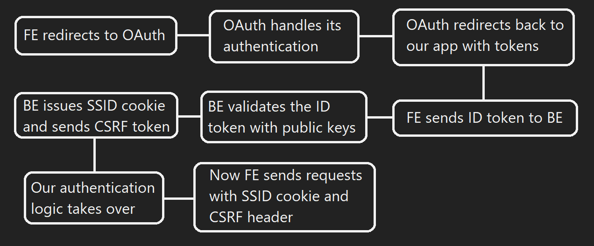

# Various flows of the application

## Application flow

- The user visits `domain.com` and is given the React FE by serve
- The user then interacts with the FE application, which sends requests to `domain.com/api/*`
- These requests get rerouted through nginx to Express BE
- Express BE handles communication with MongoDB through mongoose models

## FE SPA flow

- User has to first log in
- The flow then differs based on their role (from the 'ROLE' cookie)
- If they are a 'user'
    - Then they are directed to the home page, where they have access to posts
    - They can navigate to 'My posts' page to see and manage all their posts
    - They can also navigate to their account page to see and manage the details of their account
- If they are an 'admin'
    - Then they can see all the posts + have access to post-related operations (deletion, etc.)
    - They can navigate to 'Users' page to manage all the users of the app (ban/blacklist them, change their role, etc.)
    - They can also navigate to 'Blacklist' page to see all the blacklisted IDs

## Authentication flow

1. Frontend app will feature a `Sign in with` button, which will redirect to OAuth 2.0 provider
2. The OAuth provider will do all his necessary steps for authentication (password, MFA)
3. OAuth provider will redirect back to our app with the necessary tokens (access, refresh, id)
4. The only token we are interested in is ID token, which will get sent to Backend
5. Backend will validate the token (ID token is a JWT token)
6. If the token is valid, backend will set the SSID cookie and Set-CSRF header
7. Frontend will recieve those and future authentication will be done with them
8. SSID cookie will be sent as per usual and CSRF token will be sent in a header
